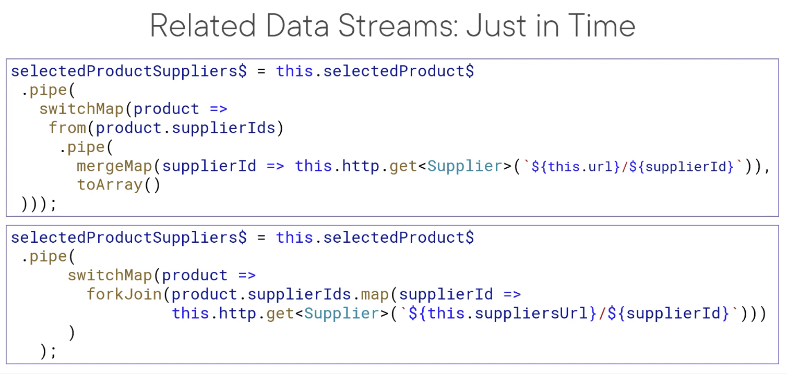

# Angular-RxJS
Find the associated Pluralsight course here: https://app.pluralsight.com/library/courses/rxjs-angular-reactive-development

`APM-Start`: The starter files for the course. **Use this to code along with the course**.

`APM-Final`: The completed files. Use this to see the completed solution from the course.

`APM-WithExtras`: The completed files with some extra code. Use this to see some additional techniques not included in the course.

I've developed a few additional examples, including using action streams to "pass" parameters and retrieve multiple related datasets here: https://stackblitz.com/edit/angular-todos-deborahk

### Notes

* No need of ngOnInit when we can directly declare and assign the Observables in the Component
* Use asObservable to expose the Subject or BehaviorSubject used in Services
* Author used Subject or BehaviorSubject in Service when it is common to 2 or more Components, otherwise used it in Component itself
* Use ChangeDetection.OnPush after using Reactive style
* Use of Subjects for Error Message in Component
* Add catchError for all http requests
* Fetching all Suppliers in supplier.service.ts

### Hot and Cold Observables

* Cold Observable(Unicast): Doesn't emit until subscribed to
  * Observable returned from http get call
* Hot Observable(Multicast): Emits without subscribers
  * Subject or BehaviorSubject

### Reacting to Actions

* Use of Subject and BehaviorSubject for Action Streams
* Combine the action and data streams
* Emit a value to the action stream when an action occurs
* startWith for initial value for Subjects
* Action Stream created with a Subject does not immediately emit
* When combining an action stream, consider using a BehaviorSubject since it emits a default value

### combineLatest, forkJoin and withLatestFrom

* combineLatest for combining the latest values from its Input Observables
  * All the Input Observables must emit once for combineLatest to emit
* forkJoin is for last values of its Input Observables
  * All the Input Observables must complete for forkJoin to emit
* withLatest is for fetching the latest values when another Source Observable emits
  * If the Source observable completes before withLatestFrom emission, no values are emitted
  * * The Input Observable must emit once for withLatest to emit


### Managing state with scan and merge

* scan: retains an accumalated value
* result is buffered and emitted
* When the Observable is complete, it no longer retains its accumulator
* merge combines multiple Observables by merging their emissions
  * When an items is emitted from any Observable, that item is emitted to its output Observable
  * It completes when all Input Observables complete

### Why Caching?

* Making http requests each time you navigate to a Page is not required for Applications that doesn't change data frequently
* Only Highly Transaction based Applications like Flight Reservation or Movie tickets require http requests(Fresh Data) each time you navigate
* Caching
  * ImprovesResponsiveness
  * Reduces bandwidth and network consumption
  * Reduces Backend server load
  * Reduces redundant computation

### Declarative Caching Pattern

* **shareReplay** operator shares its Input Observables with other subscribers
* shareReplay(1)
  * Replays the defined number of emissions on subscription, in this example the last emission(Since data streams emit once and complete)
* Late subscribers will still get the buffered data even if the Observable completes
* shareReplay is a multicast operator
  * Returns a Subject that shares a single subscription to the underlying source
* **share** operator is similar to shareReplay but by default
  * It doesn't have a buffer
  * Doesn't replay that buffer
* We can set a configuration object
* **shareReplay is a wrapper around the share operator**
```ts
share({
  connector: () => new ReplaySubject(1),
  resetOnComplete: false,
  resetOnError: false,
  resetOnRefCountZero: false
})
```
* The location of shareReplay in the pipeline matters
* The operations after the shareReplay do not get cached and gets re-executed on each emission

### Cache Invalidation

* Evaluate the fluidity of the data
* User stays for a short time and exits the Application, invalidation is not required(cleared when the User exits)
* Things to consider while invalidating:
  * Invalidate the cache on a time interval
  * Do not invalidate when the User is working
    * Allow the User to control when the data is refreshed
  * Always get fresh data on update operations

```ts
private refresh = new BehaviorSubject<void>(undefined);

product$ = refresh.pipe(
  mergeMap(() => this.http.get<Product[]>(this.url).pipe(
    catchError(this.handleError)
  ))
)

// refresh.next(undefined) when user clicks on Refresh or after a Timer
```

### Higher Order Observable

* Observables that emit other Observables
* The Source is the Observable and the one present within is the Inner Observable
* We shouldn't have nested Subscriptions within our code
* Higher Order Mapping Operators flatten higher-order Observables
* Template can't bind to Higher Order Observables

### Higher-order Mapping Operators

* Family of Operators: xxxMap()
* These Operators Automatically subscribe to/unsubscribe from the Inner Observables
* They flatten the result and emit the resulting values to the Output Observable

### concatMap

* It waits for each inner Observable to complete before processing the next one
* Concatenates their results in **sequence**
* Think of this Operator like a Relay Race

### mergeMap

* It executes the inner Observables in **parallel**
* Merges their results
* Think of this Operator like a 800m race where 
  * Runners start concurrently
  * They all merge into the lower lanes
  * The runners complete based on how quickly they finish

### switchMap

* Unsubscribes the prior inner Observable and switches to the new Inner Observable
* Subscribes to 1 inner Observable at a time
* Think of this Operator like a Coach who changes his mind as to which runner will run

### Common use case for higher order Mapping Operators

* To get data based on result of other retrieved data
```ts
todosForUser$ = this.userEnteredAction$
  .pipe(
    // Get the user given the username
    switchMap(userName => 
      this.http.get<User>(`${this.userUrl}?username=${userName}`))
      .pipe(
        // Get the todos given the user id
        switchMap(user => 
          this.http.get<ToDo[]>(`${this.todoUrl}?userId=${user.id}`))
      )
  )
```

### Related Data Streams

* 2 Approaches
  * Get it all
    * Get all the related data beforehand
    * combineLatest
  * Just in time
    * Make requests as and when required
    * mergeMap

### Get It All

```ts
selectedProductSuppliers$ = combineLatest([
    this.selectedProduct$,
    this.supplierService.suppliers$
  ]).pipe(
    map(([selectedProduct, suppliers]) =>
      suppliers.filter(supplier => selectedProduct?.supplierIds?.includes(supplier.id))
    )
  );
```

### Just in Time


```ts
selectedProductSuppliers$ = this.selectedProduct$
    .pipe(
      filter(product => Boolean(product)),
      switchMap(selectedProduct => {
        if (selectedProduct?.supplierIds) {
          return forkJoin(selectedProduct.supplierIds.map(supplierId =>
            this.http.get<Supplier>(`${this.suppliersUrl}/${supplierId}`)))
        } else {
          return of([]);
        }
      }),
      tap(suppliers => console.log('product suppliers', JSON.stringify(suppliers)))
    );
// Using forkJoin simplies the process
// Otherwise we had to use mergeMap with toArray
```

### Multiple Async Pipes to Single

* Combine all of the Observables for our view with only 1 Observable(vm$ which stands for view model) so that we will need only 1 Async pipe
```ts
// product-detail.component.ts
vm$ = combineLatest([
    this.product$,
    this.productSuppliers$,
    this.pageTitle$
  ])
    .pipe(
      filter(([product]) => Boolean(product)),
      map(([product, productSuppliers, pageTitle]) =>
        ({ product, productSuppliers, pageTitle }))
    );
// errorMessage$ is not included in combineLatest because it doesn't emit if everything is going well
```

### Tips with Action Streams

* Action Streams only emit if it is active
* If the Stream is stopped, it won't emit
* An Unhandled error causes the stream to stop
* Catch the error and replace the errored Observable
  * Don't replace an errored action Observable with EMPTY
  * Replace with a default or empty value

### Debugging Observables

* Use the tap operator before and after
* Hover over the Observable to view the type
* Is there a Subscription?
  * subscribe or async pipe
* Is there an Operator waiting for Completion?
  * Action streams do not complete, beware of this
* Walk through the flow
  * Start at the source(Maybe Http request)
  * Walk through each operator in the pipeline(Adding tap)
  * Follow through to the UI(View result in the UI)
* Draw a Marble Diagram