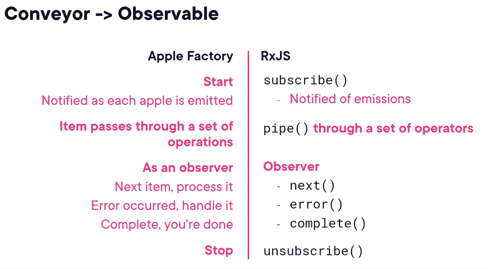

### Repository

- https://github.com/DeborahK/angular-rxjs-signals-fundamentals
- Links of various topics: https://github.com/DeborahK/angular-rxjs-signals-fundamentals/blob/main/links.md

### Reactive Programming - Signals vs RxJS Observables

- Signals
  - Observe state(variable values)
  - Notify when the state changes
  - React to those Notifications
- RxJS Observables
  - Observe events or data that arrive over time
  - Notify when the event occurs or data is emitted
  - React to those Notifications

#### RxJS + Signals: Better Together

- RxJS works great for
  - Asynchronous operations such as HTTP requests
  - Retrieving and merging related sets of data
- Signal works great for
  - Managing data after it's been retrieved + computed signals
  - Binding in the tempate for better change detection
- So use RxJS for making API calls and then when you get the response, set the Signal and use it in the template

### RxJS

- Observe and React to Events through Time
- Converyor of Apples
  

### Observable

- A collection of events or data values emitted over time
- Connects to a Source
- Emits notifications when it receives data or an event from the Source
- 3 types of Notificiations: next, error and complete

### Subscription

- An Observable must be subscribed to for it to emit values
- Unsubscribe to prevent memory leaks
- $ - convention for Observables
- Unsubscribe in ngOnDestroy

### Observer

- Observer is an object with 3 methods: next, error and complete
- observer is passed to the Observable's subscribe method

### Creating an Observable

- Creation functions: of, from, interval, timer, fromEvent

### Demo

- https://stackblitz.com/edit/rxjs-signals-m3-deborahk-bhnust?file=src%2Fmain.ts

### Operators

- Operators are functions that build on the observables
- Each Operator automatically subscribes to the Input Observable and returns a new Output Observable
- Minimize the number of operators -> To minimize operator setup and tear down, improving performance
- map - transform the values of each emission
- tap - taps into the emissions without affecting the item -> Used to perform side effects
- filter - filter the emissions based on a condition
- take - take the first n emissions and then complete
  - Insert take last if you want to take the specified number of emissions

### Retrieving Data with HTTP and Observables

- https://github.dev/DeborahK/angular-rxjs-signals-fundamentals
- Uses InMemoryWebApiModule for simulating a data server in app.config.ts

```ts
// Retrieve Products in ProductService
getProducts(): Observable<Product[]> {
  return this.http.get<Product[]>(this.productsUrl)
    .pipe(
      tap(data => console.log(data),
      catchError(this.handleError)
    ));
}

// In ProductList component
sub!: Subscription;
products: Product[] = [];

ngOnInit(): void {
  this.sub = this.productService.getProducts().subscribe(products => this.products = products);
}
```

- Strongly type the data and observable using the generic type parameters to minimize errors
- Use `provideHttpClient()` in app.config.ts to provide the the HttpClient Service and this import must be ahead of the InMemoryWebApiModule import
- Use `inject` instead of constructor injection for the HttpClient Service

### Handling HTTP Errors with Observables

- Use `catchError` to handle errors
- Replace the errored Observable with a new Observable
- In the error handler
  - Replace the errored Observable with a new Observable
  - Emit default values or an error
- Use `throwError` to create a replacement Observable that emits an error
  - Used for Propagating errors
- throw statement can be used in Observable pipeline
- EMPTY: An Observable that emits no items and immediately completes

### Getting Related Data: switchMap, concatMap and mergeMap

- https://stackblitz.com/edit/rxjs-signals-m7-deborahk?file=src%2Fmain.ts
- Checked **README.md** for `Higher Order Observable`
- Don't nest subscribes
- Higher-order Mapping Operators
  - Automatically subscribe and unsubscribe
  - Unwrap(flatten) the result
- switchMap: Use when you want to cancel the previous request and only want the latest request
- concatMap: Use when you want to maintain the order of the requests and wait for the previous request to complete
- mergeMap: Executes in parallel and doesn't maintain the order of the requests

### Using a Declarative Approach

```ts
// Procedural Approach
getProducts(): Observable<Product[]> {
  return this.http.get<Product[]>(this.productsUrl)
    .pipe(
      tap(data => console.log(data),
      catchError(this.handleError)
    ));
}

// Declarative Approach
products$ = this.http.get<Product[]>(this.productsUrl)
  .pipe(
    tap(data => console.log(data),
    catchError(this.handleError)
  ));
```
* Benefits of Declarative Approach
  * React to user actions and data emissions
  * Merge data from multiple sources
  * Share data between components
  * More easily use features like the async pipe
  * No need for OnInit when we can directly declare and assign the Observables in the Component
* Displaying Retrieving Data in the Template
  * Copy emitted data to a local variable, then use it in the template
  * Work directly with the emitted data by using async pipe in the template
  * Signals
```ts
this.products$ = this.productService.products$;
```
```html
<button> *ngFor="let product of products$ | async">
  {{ product.productName }}
</button>
```
* async pipe subscribes to the Observable, retrieves the emitted data and then unsubscribes when the component is destroyed
* 2 async pipe for the same Observable will create 2 subscriptions
  * Use `as` clause to Combine multiple observable, use one async pipe for the set

### Caching Retrieved Data

```ts
// Classic Caching Pattern
private products: Product[] = [];

getProducts(): Observable<Product[]> {
  if (this.products) {
    return of(this.products);
  }
  return this.http.get<Product[]>(this.productsUrl)
    .pipe(
      tap(data => this.products = data,
      catchError(this.handleError)
    ));
}
```

```ts
// Declarative Approach with shareReplay
products$ = this.http.get<Product[]>(this.productsUrl)
  .pipe(
    shareReplay(1),
    catchError(this.handleError),
  );
```
* The operators before the shareReplay are re-executed before the data is cached and not re-executed on next subscription
* The operators after the shareReplay are re-executed on each subscription
* Checkout **README.md** for `Declarative Caching Pattern`

### Reacting to Actions: Subject and BehaviorSubject

- Observable is Read-Only and we can't emit values
  - Only the creator of the Observable can emit values
- Subject: A special type of Observable that allows values to be multicasted to many Observers
- Unicast vs Multicast
  - Unicast: Observable that doesn't emit until subscribed to
    - When there are multiple subscribers, each Subscriber gets its own new Observable
    - Observable returned from http get call
    - Example: Netflix
  - Multicast: Observable that emits without subscribers
    - Multiple subscribers share the same emission
    - Subject or BehaviorSubject
    - Example: Movie Theatre
- Hot vs Cold Observables
  - Hot Observable: Emits without subscribers
  - Cold Observable: Doesn't emit until subscribed to
```ts
// Creating a Subect
private productSelectedSubject = new Subject<number>();
productSelected$ = this.productSelectedSubject.asObservable();
```

```ts
private productSelectedSubject = new Subject<number>();
productSelected$ = this.productSelectedSubject.asObservable();
// Using Subject to change from method with parameter to a Declarative Approach
product$ = this.productSelected$
  .pipe(
    switchMap(id =>
      this.http.get<Product>(`${this.productsUrl}/${id}`)
    ),
    catchError(this.handleError)
  );
```

### Combining Observables

- combineLatest: Combines the latest values from its Input Observables
  - All the Input Observables must emit once for combineLatest to emit
```ts
// CombineLatest
product2$ = combineLatest([
  this.products$,
  this.productSelected$
])
  .pipe(
    map(([products, selectedProductId]) =>
      products.find(product => product.id === selectedProductId)
    ),
    filter(Boolean),
    switchMap(product => this.getProductWithReviews(product)),
  );
```

- forkJoin: Combines the last values of its Input Observables
  - All the Input Observables must complete for forkJoin to emit
```ts
// forkJoin
product3$ = this.productSelected$
  .pipe(
    switchMap(selectedProductId =>
      forkJoin({
        product: this.http.get<Product>(`${this.productsUrl}/${selectedProductId}`),
        reviews: this.http.get<Review[]>(`${this.reviewsUrl}?productId=${selectedProductId}`)
      })
    ),
    catchError(this.handleError),
  );
```

- withLatestFrom: Fetches the latest values when another Source Observable emits
  - If the Source Observable completes before withLatestFrom emission, no values are emitted
  - The Input Observable must emit once for withLatest to emit
```ts
// withLatestFrom
product4$ = this.productSelected$
  .pipe(
    withLatestFrom(this.products$),
    map(([selectedProductId, products]) =>
      products.find(product => product.id === selectedProductId)
    ),
    filter(Boolean),
    switchMap(product => this.getProductWithReviews(product)),
  );
```

### Signals

- Signal = data value + change notification
- Reading a signal in a template:
  - Returns the current signal value
  - Registers the signal as a dependency of the template
  - If the Signal changes, the portion of the template is re-rendered
- Modify a Signal with `set` and `update` methods
  - set will replace the current value with a new value
  - update will update value based on current value

### Computed Signal

- Computed Signal: Signal that is derived from other Signals
- It is read-only
- It is recomputed if a dependent signal changes AND the value is read
- Computed value is memoized, meaning it stores the computed result
- That computed value is reused next time the computed signal is read, assuming the dependent signals haven't changed

### Effect

- Effect is scheduled to run any time its reference Signals change
- It is used for aid in debugging
- Avoid using effects to modify Signals

### Key Points

* Use a signal or computed signal for any state(data) that could change
* Put shared signals in services
* Continue to use Observables for async operations
* To change the value in the Signal for Arrays, we update the Signal with a new value
```ts
cartItems.update(items => [...items, {product, quantity: 1}]);
```
* **Input as Setter** to set signal

### RxJS + Signals

* toSignal: Converts an Observable to a Signal
  * Holds the most recent emitted value
  * Automatically subscribes and unsubscribes
  * This is readonly

### Error Handling Options

* Catch in the observable pipeline, create a replacement observable, pass valid data to the signal
* Catch us try...catch

### Creating an Observable from a Signal (toObservable)

* toObservable: Converts a Signal to an Observable
  * Emits the current value of the Signal
  * Emits the value when the Signal changes